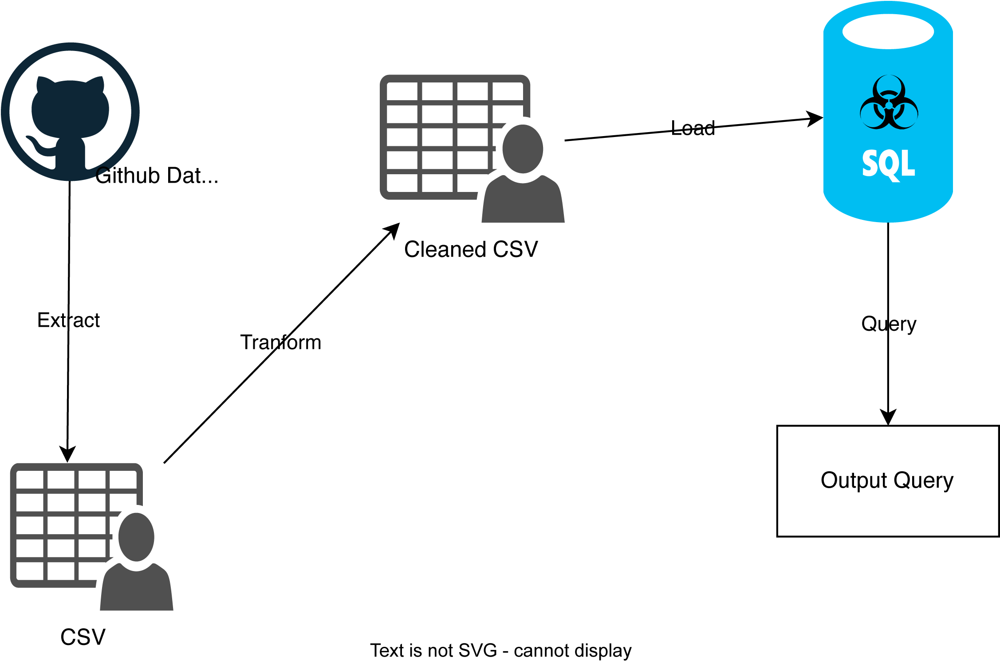

## Kaisen_Yao_IDS706_Week5

[](https://github.com/nogibjj/Kaisen_Yao_IDS706_Week5/actions/workflows/cicd.yml)

### File Structure
```
Kaisen_Yao_IDS706_Week5/
├── .devcontainer/
│   ├── devcontainer.json
│   └── Dockerfile
├── .github/
│   └── workflows/cicd.yml
├── .gitignore
├── AD_flow.png
├── data/
│   └── US_births.csv
├── Dockerfile
├── LICENSE
├── main.py
├── Makefile
├── mylib/
│   ├── __init__.py
│   ├── __pycache__/
│   ├── extract.py
│   ├── query.py
│   └── transform_load.py
├── query_log.md
├── README.md
├── requirements.txt
├── US_births_DB.db
├── setup.sh
└── test_main.py
```

## Purpose of project
The purpose of this project is to build an ETL-Query pipeline. I use FiveThirtyEight's public dataset to extract it into a local csv file, tranfrom the csv file by cleaning it, loading it into a .db file, and querying it with SQLlite. 

## Preparation
1. open codespaces 
2. wait for container to be built and virtual environment to be activated with requirements.txt installed 
3. extract: run `make extract`
4. transform and load: run `make transform_load`
4. query: run `make query` or alternatively write your own query using `python main.py general_query <insert query>`

## Sample CRUD Operations 
Explanations of functions can be found [here](https://github.com/nogibjj/Kaisen_Yao_IDS706_Week5/blob/main/mylib/query.py)
1. Create: `create a new record: '2008', '8', '8', '1', '9999'`
2. Read: `read all data`
3. Update: `update record 1: day_of_week = 1, births = 6666 `
4. Delete: `delete record 2`

## Check format and test errors 
1. Format code `make format`
2. Lint code `make lint`
3. Test coce `make test`

## Simple Vizualization of Process


## References 
https://github.com/nogibjj/sqlite-lab